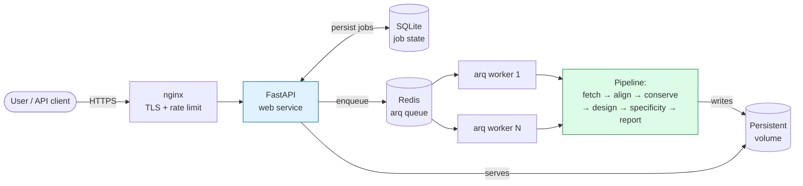
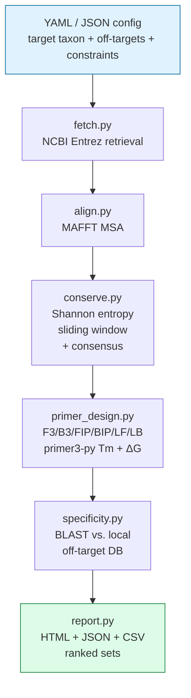

# LAMP-Forge

**Reproducible LAMP primer design for microbial diagnostic assays.**

LAMP-Forge is an open-source bioinformatics pipeline that turns a taxonomic
target ("I want a LAMP assay for *Mycobacterium tuberculosis*") into a ranked,
ready-to-order list of LAMP primer sets — backed by sequence conservation
analysis, thermodynamic vetting, and in silico off-target screening.

It is designed so that a **wet-lab scientist with intermediate Python** can
clone the repo, point Docker at a YAML config, and get an HTML report in one
command. Every design decision is documented in [docs/workflow.md](docs/workflow.md)
and the code itself.

---

## What is LAMP and why does this exist?

**Loop-mediated Isothermal Amplification (LAMP)** is a nucleic-acid amplification
technique introduced by Notomi et al. in 2000. Unlike PCR, LAMP runs at a single
temperature (60–65 °C) and uses a strand-displacing polymerase, so it can be
read out by eye (turbidity, intercalating dye, or pH shift) without a
thermocycler. That makes it the workhorse of point-of-care and field
diagnostics — think TB screening in rural clinics, foodborne pathogen
detection on a farm, and the rapid SARS-CoV-2 colorimetric kits you saw on
news clips in 2020.

The catch: a LAMP reaction needs **six primers** (F3, B3, FIP, BIP, LF, LB)
binding to **eight distinct regions** of the target, all with matched melting
temperatures, all thermodynamically clean, and all hitting a conserved enough
region of the target genome to work across clinical isolates *without*
amplifying close relatives. Designing that by hand is tedious and error-prone.
The few commercial primer-design tools that exist are closed-source, expensive,
and don't expose the trade-offs.

LAMP-Forge gives you:

- **The whole pipeline, open and reproducible.** Pinned dependencies,
  Snakemake DAG, Docker image, GitHub Actions CI. Same input → same output.
- **Transparent science.** Every step (conservation entropy, primer geometry,
  BLAST scoring) is plain Python with citations in the docstrings.
- **A real off-target screen.** Not just BLAST against NCBI nt — you supply
  the off-target genomes you actually care about (close relatives, common
  contaminants, host DNA), and we build a local BLAST DB to screen against.
- **Ranked output a wet-lab scientist can act on.** HTML report with
  conservation plots and specificity heatmaps, JSON for downstream pipelines,
  and a flat CSV ready for IDT / Twist / Eurofins ordering.

---

## Quickstart

LAMP-Forge ships in two modes:

| Mode | Use when |
|---|---|
| **Web service** | You want a UI / API. Multi-user, async jobs, persistent results. The "industry-ready" path. |
| **CLI / library** | You're scripting, on HPC, or want a single-shot reproducible run. |

### Option A — Web service (Docker, recommended)

Spins up FastAPI + arq workers + Redis + (optional) nginx. UI on
`http://localhost:8000`, OpenAPI docs at `/api/docs`.

```bash
# 1. Clone and bootstrap.
git clone https://github.com/lamp-forge/lamp-forge.git
cd lamp-forge
cp .env.example .env  # then edit: NCBI_EMAIL, NCBI_API_KEY, API keys

# 2. Bring up the stack (web + worker + redis).
docker compose up -d web worker redis

# 3. Open the dashboard.
open http://localhost:8000          # macOS
xdg-open http://localhost:8000      # Linux
start http://localhost:8000         # Windows
```

Submit a job via the dashboard, or via the API:

```bash
# Upload off-target FASTAs
curl -X POST http://localhost:8000/api/v1/uploads \
     -H "Authorization: Bearer $LF_KEY" \
     -F "file=@off_targets/m_smegmatis.fasta"

# Submit a job
curl -X POST http://localhost:8000/api/v1/jobs \
     -H "Authorization: Bearer $LF_KEY" \
     -H "Content-Type: application/json" \
     -d @config/example_job.json

# Poll
curl -H "Authorization: Bearer $LF_KEY" http://localhost:8000/api/v1/jobs/<id>
```

For production, enable the nginx profile and provide TLS certs:

```bash
docker compose --profile prod up -d
```

Scale workers horizontally:

```bash
LAMP_FORGE_WORKER_REPLICAS=4 docker compose up -d worker
```

See [docs/deployment.md](docs/deployment.md) for the full production guide.

### Option B — CLI / single-shot

```bash
docker compose --profile cli run --rm lamp-forge \
  run --config /work/config/example_config.yaml

# Open the HTML report.
open results/lamp_forge_report.html
```

### Option C — local install (no Docker)

You need `python>=3.11`, `mafft`, and `ncbi-blast+` on `$PATH`.

```bash
# Ubuntu/Debian:  sudo apt install mafft ncbi-blast+
# macOS (brew):   brew install mafft blast

git clone https://github.com/lamp-forge/lamp-forge.git
cd lamp-forge

# CLI only:
pip install -e ".[dev]"
lamp-forge run --config config/example_config.yaml

# Or web service (also needs a local Redis):
pip install -e ".[dev,web]"
LAMP_FORGE_REDIS_URL=redis://localhost:6379/0 lamp-forge-web --reload
# In a second terminal:
LAMP_FORGE_REDIS_URL=redis://localhost:6379/0 lamp-forge-worker
```

### Interactive walkthrough

```bash
docker compose --profile interactive up jupyter
# then open http://localhost:8888/lab/tree/notebooks/01_walkthrough.ipynb
```

---

## Architecture



The pipeline itself (the `PIPE` box) is:



Each box maps to a module in [src/lamp_forge/](src/lamp_forge/) and a rule
in the [Snakefile](Snakefile).

---

## Configuration

A minimal config (`config/example_config.yaml`) looks like:

```yaml
target:
  name: mycobacterium_tuberculosis
  taxon_id: 1773              # NCBI taxonomy ID
  gene: rpoB                  # leave null to use full assembly
  max_sequences: 20           # cap on retrieved sequences
  email: you@your-inst.edu    # NCBI courtesy

off_targets:
  fasta_dir: input/off_targets       # all *.fa / *.fasta files used
  min_identity_threshold: 0.80       # ≥80% identity flagged
  min_coverage_threshold: 0.80       # over ≥80% of primer length

conservation:
  window_size: 30
  entropy_threshold: 0.20            # bits — lower = more conserved
  min_region_length: 200             # LAMP needs ~200bp target span

primer:
  tm_min: 60.0
  tm_max: 65.0
  tm_match_tolerance: 2.0            # max Tm spread across the set
  gc_min: 40.0
  gc_max: 65.0
  hairpin_dg_threshold: -2.0         # kcal/mol — more negative is worse
  dimer_dg_threshold: -5.0
  amplicon_size:
    f2_b2_min: 120
    f2_b2_max: 160

output:
  dir: results
  top_n: 10                          # primer sets per conserved region
  generate_html: true
  generate_csv: true
```

Every parameter is explained in [docs/workflow.md](docs/workflow.md).

---

## Output

After a successful run, `results/` contains:

| File | What it is |
|---|---|
| `lamp_forge_report.html` | Interactive HTML report with conservation plots and specificity heatmaps |
| `primer_sets.json` | Full ranked list of primer sets with all metadata, for piping into downstream tools |
| `primer_sets.csv` | Order-ready flat table: name, sequence, Tm, GC%, length |
| `conservation.tsv` | Per-position entropy and consensus across the MSA |
| `specificity.tsv` | Raw BLAST hits per primer per off-target genome |
| `run_manifest.json` | Versions, config snapshot, input checksums — for reproducibility |

---

## Limitations and caveats

**In silico predictions are not wet-lab validation.** This pipeline scores
primer sets on conservation, thermodynamics, and in-silico specificity. It
does **not**:

1. Guarantee amplification will work in your buffer / polymerase / sample
   matrix. Bst 2.0, Bst 3.0, and Gss-IsoPol behave differently.
2. Replace empirical specificity testing against your real off-target panel
   (clinical isolates, environmental contaminants, host DNA). BLAST identity
   is a proxy, not a reaction.
3. Predict matrix effects (inhibitors in sputum, stool, soil, food).
4. Substitute for a positive/negative cohort study before deploying as a
   diagnostic.

**Recommended downstream validation:**

- Pick the top 3–5 ranked sets, order primers, run a temperature gradient
  on synthetic target DNA at 10⁰–10⁶ copies/reaction.
- Test against your real off-target panel and confirm no amplification at
  the chosen incubation time (typically 30–60 min).
- For clinical use, run a contrived sensitivity/specificity panel before
  patient samples.

**Known scope limits:**

- Primer **design** is single-target (one taxon/gene per run). For multiplex
  panels — the mode portable platforms use to read many targets from one
  sample — design each target separately, then run `lamp-forge panel` to screen
  the sets for inter-assay cross-dimerisation and pick a compatible
  combination. See [Recipe 8](docs/cookbook.md) for the full workflow.
- The off-target screen relies on user-supplied genomes; it will miss
  unknown unknowns.
- Currently bacterial-focused; viral LAMP works but the conserved-region
  defaults may need tightening for highly variable genomes (HIV, influenza).

---

## Citations

If you use LAMP-Forge in published work, please cite:

1. **LAMP technique:** Notomi T, Okayama H, Masubuchi H, et al. Loop-mediated
   isothermal amplification of DNA. *Nucleic Acids Res*. 2000;28(12):E63.
   doi:10.1093/nar/28.12.e63
2. **MAFFT alignment:** Katoh K, Standley DM. MAFFT multiple sequence
   alignment software version 7. *Mol Biol Evol*. 2013;30(4):772-780.
3. **primer3:** Untergasser A, Cutcutache I, Koressaar T, et al. Primer3 —
   new capabilities and interfaces. *Nucleic Acids Res*. 2012;40(15):e115.
4. **BLAST+:** Camacho C, Coulouris G, Avagyan V, et al. BLAST+:
   architecture and applications. *BMC Bioinformatics*. 2009;10:421.
5. **Biopython:** Cock PJA, Antao T, Chang JT, et al. Biopython: freely
   available Python tools for computational molecular biology and
   bioinformatics. *Bioinformatics*. 2009;25(11):1422-1423.
6. **Snakemake:** Mölder F, Jablonski KP, Letcher B, et al. Sustainable data
   analysis with Snakemake. *F1000Research*. 2021;10:33.

And cite this repo:

```
LAMP-Forge contributors (2026). LAMP-Forge: a reproducible LAMP primer
design pipeline. https://github.com/lamp-forge/lamp-forge
```

---

## Project layout

```
lamp-forge/
├── README.md                  ← you are here
├── pyproject.toml             ← Python package + tooling config
├── Dockerfile                 ← MAFFT + BLAST+ + Python stack
├── docker-compose.yml         ← single-command runs + jupyter profile
├── Snakefile                  ← pipeline DAG
├── .github/workflows/ci.yml   ← lint, type-check, test on every PR
├── config/
│   └── example_config.yaml    ← Mycobacterium tuberculosis worked example
├── src/lamp_forge/
│   ├── cli.py                 ← Click CLI entry point
│   ├── fetch.py               ← NCBI Entrez retrieval + caching
│   ├── align.py               ← MAFFT wrapper
│   ├── conserve.py            ← Shannon entropy + consensus
│   ├── primer_design.py       ← F3/B3/FIP/BIP/LF/LB designer
│   ├── specificity.py         ← Local BLAST off-target screen
│   ├── report.py              ← HTML + JSON + CSV output
│   └── panel.py               ← multiplex cross-dimer compatibility (lamp-forge panel)
├── tests/                     ← pytest, >80% coverage
├── notebooks/
│   └── 01_walkthrough.ipynb   ← end-to-end Mycobacterium example
└── docs/
    ├── workflow.md            ← the science behind each step
    ├── lamp_primer_design.md  ← LAMP primer geometry, citing Notomi 2000
    └── cookbook.md            ← real-world recipes & use cases
```

---

## Contributing

Bug reports, primer-design improvements, and new off-target screen modes
welcome. Run `pytest` and `ruff check .` before opening a PR. CI will run
mypy strict and >80% coverage gates.

---

## License

MIT — see [LICENSE](LICENSE).
